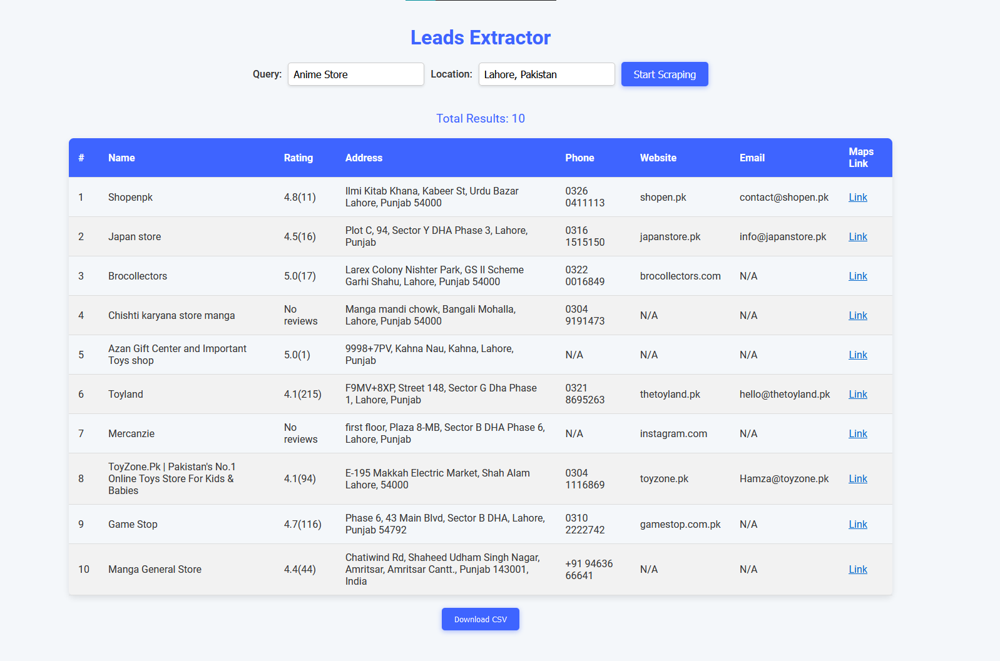

# Leads Extractor

Leads Extractor is a web application built with Flask that allows you to scrape using Google Maps for business information. It retrieves and displays details such as name, rating, address, phone number, website, and email. The extracted data can be viewed in a table and downloaded as a CSV file.

## Features

- **Google Maps Scraping**: Extract business details based on search queries and locations.
- **Data Display**: View scraped data in an organized table format.
- **CSV Download**: Export the data as a CSV file.
- **Dynamic Updates**: Automatically update the results table as new data is fetched.

## Installation

1. Clone this repository:
    ```bash
    git clone https://github.com/your-username/leads-extractor.git
    ```
2. Navigate to the project directory:
    ```bash
    cd leads-extractor
    ```
3. Install the required dependencies:
    ```bash
    pip install -r requirements.txt
    ```
4. ~~Download ChromeDriver compatible with your Chrome browser version. Ensure that `chromedriver.exe` is placed in the `Chromedriver` directory.~~ (You don't need to do this anymore, Code will do it for you)
5. Run the Flask application:
    ```bash
    python app.py
    ```
## Screenshot


## Usage

1. Open your browser and go to `http://127.0.0.1:5000`.
2. Enter your search query and location in the form and click "Start Scraping."
3. The application will start scraping Google Maps and display the results in the table.
4. Once scraping is complete, you can download the results as a CSV file by clicking the "Download CSV" button.

## Contributing

Feel free to open an issue or submit a pull request if you have any improvements or bug fixes.

## Libraries

- **Flask**: For building the web application.
- **Selenium**: For browser automation and scraping.
- **BeautifulSoup**: For parsing HTML content.
- **Requests**: For handling HTTP requests.

